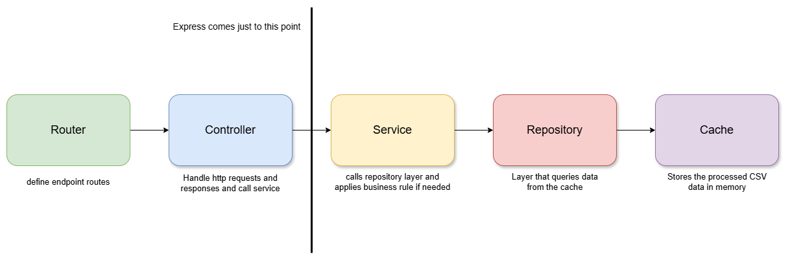

# 📦 Backend Developer Challenge – IP Location API

## ✨ Description

This project consists of a REST API developed in TypeScript that resolves an IP location based on a dataset.

---

## 🚀 How to run the project

### 1. Install dependencies

```bash
yarn install
```

### 2. Run the server
#### 2.1 Run in development mode

```bash
yarn dev
```
#### 2.2 Run in production mode

```bash
yarn build
yarn start
```

### 3. Run unit tests

```bash
yarn test
```

### 3. Run performance tests

**Note:** The server must be running on `http://localhost:3000` before executing performance tests.

```bash
yarn test:performance
```

---

## 📂 Project structure

```text
src/
├── cache/               # Stores the processed CSV in memory
├── controllers/         # Layer responsible for handling HTTP requests
├── repositories/        # Layer that queries data from cache
├── routes/              # API route definitions
├── services/            # Layer that orchestrates and processes repository data
├── tests/               # Project unit tests
├── types/               # Types used in the project
├── utils/               # Helper functions like CSV reading and IP calculations
├── index.ts             # Application entry point
└── server.ts            # Express server initialization
```

---

## 🛠️ Architectural decisions

* **Layered architecture:**
  The project uses a layered architecture, dividing responsibilities between Router, Controller, Service, Repository, and Utils.

* **In-memory cache:**
  CSV data is loaded once during server startup and stored in cache, ensuring high query performance.

* **Efficient search:**
  Uses binary search over the sorted dataset to quickly locate the IP.

* **Unit tests:**
  All utility logic, controllers, services, repositories and cache have test coverage.

* **Error handling:**
  Clear responses were implemented for:

  * Missing IP (400)
  * IP not found (404)
  * Internal server errors (500)

---

## 🔭 Representation



---
